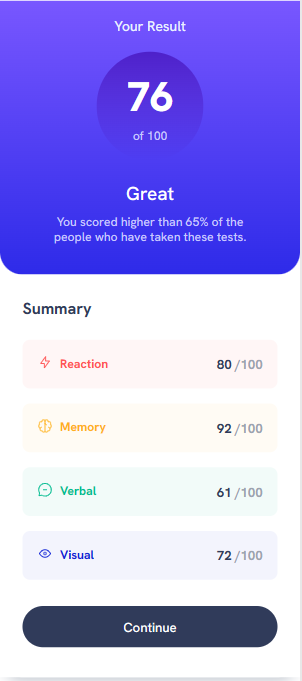
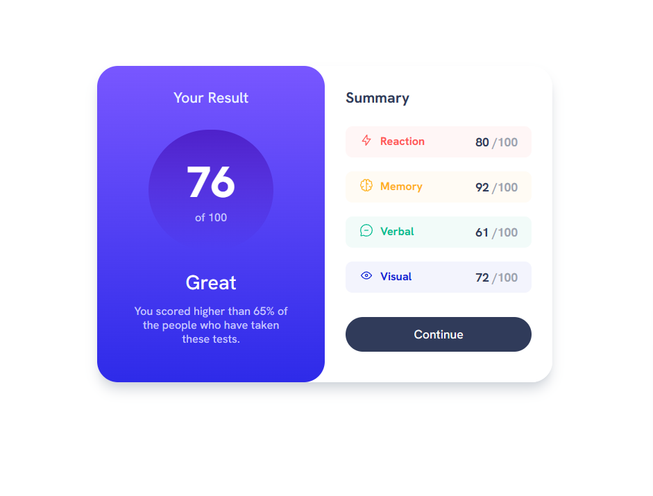

# Frontend Mentor - Results summary component solution

This is a solution to the [Results summary component challenge on Frontend Mentor](https://www.frontendmentor.io/challenges/results-summary-component-CE_K6s0maV) 

### Links

- Solution URL: [Add solution URL here](https://github.com/manjubhaskar02/FM2--result-summary-component)
- Live Site URL: [Add live site URL here](https://manjubhaskar02.github.io/FM2--result-summary-component/)

## My process

### Built with

- Semantic HTML5 markup
- CSS custom properties
- Mobile-first workflow
- Taiwind CSS
### What I learned

How to center an element bot vertically and horizontally

  

 

## Author

- Frontend Mentor - [manjubhaskar02](https://www.frontendmentor.io/profile/manjubhaskar02)

## Acknowledgments
I would like to thank my hubby for inspiring me and helping me to do this work!

